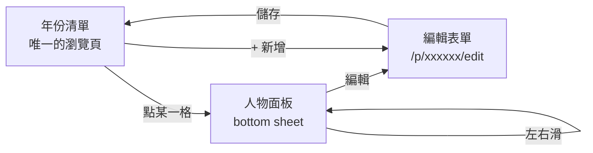

# 實驗室校友族譜網站 — 開發規格

2026-09-20 · @Celine

## 1. 專案目的與設計原則

建立一個公開網站，整理實驗室教授歷年指導的研究生名單，讓教授看到他的學生「族譜」。資料由實驗室校友共同建立與補充，不依賴單一負責人統一輸入。資料無機密性，不需登入即可瀏覽與編輯。

### 使用者

| 角色 | 情境 | 對設計的要求 |
| --- | --- | --- |
| 教授（主要讀者） | 滑著看，可能使用較舊的手機 | 快、字大、不要求任何操作 |
| 校友（貢獻者） | 零碎時間補一筆資料或傳一兩張老照片 | 手機優先、步驟極短、隨時可中斷 |
| 專案擁有者 | 執行 CSV 匯入、處理不當內容 | script 與管理後門，不開放給一般使用者 |

### 規模

約 200～400 人、數百張照片，年份跨度約 1970～2006。資料量極小，所有取捨以「簡單好維護」優先於「可擴展」。

### 核心設計原則

**缺漏要看得見。** 眾包能否成立，取決於使用者一眼看出哪裡是空的。未填欄位必須有視覺呈現，不可留白消失：畢業年未填顯示「？」；學位狀態「未知」要有待補標記；沒有照片顯示淡色的「＋ 新增照片」空位，不放灰色預設頭像。空位本身就是邀請。

**降低貢獻門檻。** 可分批分次輸入。除「中文姓名」與「入實驗室年」外所有欄位皆可留空。上傳照片是順手的衝動行為，不可要求先進入編輯流程。

**瀏覽時不離開主軸。** 網站只有一條主軸：年份 → 人。瀏覽全程不換頁，避免返回後捲動位置跑掉。

**開放覆寫，但可還原。** 任何人可修改任何人的資料，因此所有變更都留下紀錄，刪除一律為軟刪除。

## 2. 資料結構

只有兩個 entity：Person 與 GroupPhoto。個人照直接存在 Person 裡的陣列，不獨立成表。

### Person

| 欄位 | 必填 | 型別 | 說明 |
| --- | --- | --- | --- |
| personId | 是 | string(6) | 系統產生，見下方規則 |
| nameZh 中文姓名 | 是 | string |  |
| yearJoined 入實驗室年 | 是 | number | **唯一分組依據**，第一次進實驗室的年份 |
| nameEn 英文姓名 | 否 | string |  |
| nickname 暱稱 | 否 | string |  |
| hasMaster 有碩士學位 | 否 | yes / no / unknown | 預設 unknown |
| masterStart 碩士入學年 | 否 | number |  |
| masterEnd 碩士畢業年 | 否 | number |  |
| masterThesis 碩士論文 | 否 | string | 中英文自由填，不分欄 |
| hasPhd 有博士學位 | 否 | yes / no / unknown | 預設 unknown |
| phdStart 博士入學年 | 否 | number |  |
| phdEnd 博士畢業年 | 否 | number |  |
| phdThesis 博士論文 | 否 | string |  |
| currentStatus 現況 | 否 | string | 表單需標示「請勿輸入任何個資」 |
| photos 個人照 | 否 | array，最多 2 | 見第 4 節 |
| updatedAt | — | ISO 8601 | 後端自動蓋，前端不送 |
| updatedBy | 否 | string | 選填署名，留空即可 |

### 欄位語意（必須寫進程式註解）

**學位欄位僅指本實驗室取得的學位。** 若某人碩士在別校、博士才進本實驗室，碩士那一組欄位完全不填（hasMaster 維持 unknown 或設為 no）。此規則不明確會導致同一批資料出現兩種填法。

**學位狀態是三態，不是 boolean。** `unknown` 代表「還沒人填」，`no` 代表「確定沒有」。兩者在 UI 上呈現完全不同：前者是待補標記，後者顯示為「僅博士」之類的確定資訊。用 boolean 會讓這兩件事無法區分，眾包就失去補資料的線索。

**學位狀態是唯一真相，年份與論文只是細節。**「hasMaster = yes 但年份不詳」是合法狀態。

**不儲存任何聯絡資訊。** 無 email、無電話。公開無登入頁面放聯絡資訊等於送給爬蟲。

### personId 產生規則

- 6 碼英數字，**去除易混淆字元 0 / O / 1 / l / I**
- 隨機產生，寫入前查詢確認未重複
- **不可用年份編碼**（如 `2000-03`）：入實驗室年是可被修改的欄位，而 id 必須永遠不變，兩者綁定遲早出現 id 與資料不一致
- 會在三處對使用者露出：網址 `/p/xxxxxx`、CSV 匯出欄位、合併重複資料的確認畫面

### GroupPhoto

| 欄位 | 必填 | 型別 | 說明 |
| --- | --- | --- | --- |
| photoId | 是 | string(6) | 同 personId 規則 |
| year 年份 | 是 | number | **單一值**，決定掛在哪個年份區塊 |
| s3Key | 是 | string | 原圖 |
| thumbKey | 是 | string | 縮圖 |
| caption 說明 | 否 | string |  |
| status | 是 | active / hidden | 軟刪除用 |
| uploadedAt | — | ISO 8601 | 後端自動 |
| uploadedBy | 否 | string | 選填署名 |

一張團體照只屬於一個年份。想讓同一張出現在兩個年份，就上傳兩等（改為上傳兩亊數）——複製一份的成本遠低於維護「多年份 + 兩種刪除語意」（是從這一年移除標記，還是整張刪掉）。

團體照**不標記人物**。此功能經評估後移除，理由見第 8 節。

## 3. 畫面與互動

真正的「頁」只有兩個：年份清單與編輯表單。人物資料以覆蓋層呈現，不換頁。



### 年份清單（首頁 `/`）

**年份依資料動態產生，只顯示有人的年份。** 不寫死 1970～2006 的範圍。空白年份不顯示——因為無法分辨「那年沒收學生」與「還沒人來填」，顯示出來等於做了一個可能錯誤的宣告。有人填 1968 就自動出現 1968，不需改程式。

**年份標題只顯示年份與人數**，例如「2000　3 人」，收合與展開時都一樣。不顯示待補人數之類的統計：展開後每張卡片已經寫著缺什麼，標題再數一次是重複的；而且那個數字在初期幾乎永遠等於總人數，等於一個不會動的裝飾。

年份預設收合，點擊展開後顯示：

1. **該屆學生的格狀排列**——手機兩欄、桌機四欄。目的是一眼看完一整屆。一格的內容見下方「卡片內容」。
2. **格狀清單最後一格**固定是「＋ 新增這一年的學生」。
3. **團體照橫向照片帶**，位於格狀清單下方。最後一格固定是「＋ 新增合照」。

**不使用橫向 carousel 呈現學生。** 一次只看得到一到三張卡，會消滅「一眼看到一整屆」這件事，也讓缺漏藏起來無人發現；桌機無滑動手勢，操作更彆扭。

### 卡片內容

一格分左右兩區：左邊是需要打字的資料，右邊是照片。兩者分開，文字列表裡不混進照片。

**左區（由上而下）**

1. 姓名
2. 學位徽章（碩／博，可同時有兩個）
3. 缺漏文字：`缺 論文 · 學位`

**缺漏文字規則**

- **寫出欄位名稱，不顯示數字。**「待補 2」只回答數量，而數量不是行動的依據；校友要看到「缺論文」才知道自己幫不幫得上忙。
- 最多顯示 2 項，其餘收成 `+N`。手機兩欄排不下三個詞。
- 排序：學位 → 論文 → 畢業年。
- **照片不列入缺漏文字，也不列入任何缺漏計數。** 照片的缺漏由右區的虛線框表達，不必再數一次。
- 全部補齊者不顯示任何缺漏文字。

**右區（照片位）**

- 有照片 → 顯示縮圖
- 沒照片 → 顯示虛線空框＋上傳圖示，點擊直接叫出相簿
- **視覺重量要低**：32～36px、細線、圖示顏色比姓名淡兩階。初期幾乎每個人都沒照片，框太搶眼會讓整頁變成雜訊，反而失去提示作用。
- 實際可點範圍給到 44px 見方（視覺可較小），避免手機誤觸。
- 此框必須 `stopPropagation`，否則會同時觸發卡片的開啟面板。

**顏色**

缺漏文字用 `--text-muted` 等級的灰即可，不要用黃色或其他警示色。初期九成的人都不完整，全部染成警示色等於沒有警示——眼睛會很快學會整片忽略。

### 最近更新

首頁最上方一行，例如「最近有人補了 1985 年張三的論文」。取最近數筆 `updatedAt` 排序即可。這是眾包網站的動能來源——它證明真的有人在用，會帶動其他人也來填。

### 人物面板（覆蓋層，非換頁）

點格狀清單任一格 → 由畫面下方滑上的 bottom sheet，約佔螢幕七成高。桌機同一元件改為中央 modal。

內容由上而下：

- 個人照縮圖，最多 2 張；沒有時顯示淡色「＋ 新增照片」空位
- 完整資料欄位（未填者依「缺漏要看得見」原則呈現）
- 最底部「編輯」按鈕

**面板內的空欄位寫「＋ 新增」，不寫「？未填」。**

- 「？未填」描述狀態，「＋ 新增」邀請動作。看到前者只知道「沒有」，看到後者才會想「那我填一下」。
- **必須真的可點**：點擊直接進入編輯頁並自動聚焦到該欄位。面板底部已有「編輯資料」大按鈕，使用者會預設欄位旁的文字只是說明；若寫成「＋ 新增」卻不能點，就變成一個騙人的按鈕，比原本更糟。
- **不要問號。** 加號已足夠，且與照片區的「＋ 新增照片」語彙一致。沒填不是錯誤，問號帶有「這裡有問題」的暗示。
- **顏色用灰，不用黃或其他警示色**，與「＋ 新增照片」同一階。空位需要看得見，不需要警示；一頁四五個亮黃色的空欄位會比論文標題還搶眼，資料本身反而浮不出來。

**底部按鈕需計入安全區域。** 固定在面板底部的「編輯資料」按鈕要加 `env(safe-area-inset-bottom)`，否則在 iOS 上會被 home indicator 截掉一截。

行為要求：

- **可左右滑動切換同屆的上一位／下一位。** 格狀看全貌、面板逐一細看。
- **開啟時以 history API 將網址換成 `/p/xxxxxx`**，不換頁。他人由此連結進入時，自動展開該年份、捲到該位置、開啟面板。
- **開啟時必須鎖住背景捲動。** 否則手機上滑面板內容時背景清單會跟著跑，這是 bottom sheet 最常見的 bug。
- 關閉後回到原位置，因為底層清單從未移動，不需要還原捲動位置。

**博士入學年與入實驗室年不同時，不在博士那年另外顯示卡片。** 每人只在入實驗室年出現一次，卡片上掛碩、博兩個徽章，。

### 編輯表單（獨立頁 `/p/xxxxxx/edit`）

獨立頁而非面板，因為表單應獨佔畫面，且手機鍵盤彈出時面板式表單容易被擠壓變形。只處理文字欄位，照片不在此上傳。

表單底部有「你是誰？（選填）」欄位，寫入 `updatedBy`。它的作用不是追責，是讓後來的人看修改紀錄時知道可以去問誰。

### 新增 Person 的兩個入口

| 入口 | 位置 | 年份 |
| --- | --- | --- |
| 主要 | 年份展開後，格狀清單最後一格 | 已預填該年份 |
| 次要 | 頁面最上方「＋ 新增學生」 | 需手動填 |

次要入口的存在理由：若某人是 1968 進實驗室、而清單上尚無 1968 這個年份，從年份區塊內永遠加不進去。兩個入口走同一個表單，差別只在年份是否預填。

## 4. 照片

照片只有兩種，各自長在它所屬的東西旁邊。目的是族譜，不是實驗室相簿，因此上限刻意訂得很低。

|  | 個人照 | 團體照 |
| --- | --- | --- |
| 儲存位置 | Person.photos 陣列 | GroupPhoto 表 |
| 上限 | 每人 2 張 | 每年份 10 張 |
| 上傳入口 | 人物面板內 | 年份區塊的照片帶 |
| 顯示位置 | 該人物面板 | 該年份區塊 |
| 誰能刪 | 任何人 | 任何人 |

### photos 陣列元素

```json
{ "s3Key": "...", "thumbKey": "...", "caption": "", "uploadedAt": "...", "uploadedBy": "" }
```

用陣列而非 `photo1` / `photo2` 兩組平行欄位：刪掉第一張時陣列不會留下空洞，也不必處理「往前遞補或留空」的邏輯。上限即陣列長度不超過 2。DynamoDB 原生支援 list 屬性。

**不設 coverPhotoId。** 只有兩張，格狀清單直接顯示較早上傳那張，省掉一個欄位與一個「設為代表」的介面。

### 上傳行為

**個人照在人物面板內即時上傳，不經過編輯表單。** 上傳照片是「看到某人沒照片，順手傳一張」的衝動行為；中間隔一個「編輯 → 表單 → 儲存」，多數人會放棄。上傳完就地出現。

**團體照從年份照片帶最後一格上傳**，上傳後可填說明（選填，可跳過）。

**上限滿了要明確提示「請先刪一張」，不可靜默失敗。** 無登入網站的錯誤訊息必須直白。

**前端自動壓縮，長邊約 1600px。** 這是老照片翻拍，手機直拍檔案動輒 5MB；不壓縮會拖垮 S3 費用與載入速度。壓縮後再取得 presigned URL 上傳。

### 刪除

- 需二次確認。無登入又可覆寫，誤刪是遲早的事，照片比文字更難救。
- **一律軟刪除**：`status` 標記為 `hidden`，S3 物件不實際刪除。此規模的儲存費用趨近於零，但救得回來。
- 照片刪除同樣寫入修改紀錄。

## 5. 無登入衍生的規則

「不需登入、任何人可覆寫」是刻意的設計，但它必然帶來四個問題，每一個都要有對應機制。

### 修改紀錄與還原

每次儲存 append 一筆 revision：時間、改前的完整內容、選填署名。UI 在人物面板提供「修改紀錄／還原」。

沒有這個機制，遲早有人手殘把 1978 年那批資料洗掉，而且無法察覺。此規模的資料量下，保留全部歷史幾乎不花錢。

### 寫入驗證（暗號題）

**瀏覽完全不需要通過任何關卡。** 打開網址直接看到內容，零阻礙——教授是主要讀者，不能讓他一進站就被考試；校友分享 `/p/xxxxxx` 連結時，對方點進去也必須直接看到資料。

**第一次寫入時才出題。** 按下「儲存」或「上傳照片」時跳出一題：

> 實驗室名稱縮寫（三個大寫英文字）：

答對後由後端發一個 token 存入 localStorage，此後該裝置所有寫入自動帶著，**不再詢問第二次**。

**題目與答案放在後端，答案比對要寬鬆。** 去空白、不分大小寫、全半形正規化。這是防機器人不是入學考試，答對率要接近 100%。若答案寫在前端 JS 裡等於公開。

**這不是資安，純粹是防機器人。** 公開無登入的寫入 API 上線數週內就會被掃到並灌垃圾。機器人不會載入網頁、不會填表單，它直接對 API 端點發 POST——因此驗證必須發生在後端，純前端的關卡完全無效。token 外流無所謂，換一題即可。

### Rate limit

所有寫入端點加上頻率限制，以 IP 為單位即可。

### 管理者後門

一組獨立密鑰（與暗號不同），可隱藏或刪除任何內容。

用途是：有人在「現況」欄位填了手機號碼時，擁有者能在三十秒內處理掉，不必改程式重新部署。表單上的「請勿輸入任何個資」提示擋不住決心要填的人，真正有效的是能立刻刪除。

### 重複資料的偵測與合併

無登入 + 可覆寫 + CSV 匯入 + 各自輸入，必然出現同一人兩筆。

- **soft key 為「中文姓名 + 入實驗室年」。** 新增時若命中，跳出「是不是這一位？」讓使用者選擇編輯既有資料或確認另開新人。
- **必須提供「合併兩筆」功能**，否則重複資料永遠清不掉。合併畫面需顯示雙方 personId 供確認。
- 合併規則：保留其中一筆的 personId，逐欄選擇保留哪一邊的值，照片合併後若超過 2 張需要求使用者取捨。

## 6. CSV 匯入 script

**網站上完全不提供匯入介面。** 匯入只由專案擁有者以 script 執行。理由是 CSV 匯入的錯誤都是批次的——欄位對錯一格、編碼判錯，就是三百筆一起壞。這件事不該開放給無登入的網頁。

### 必要行為

**1. dry-run 為預設。** 不帶參數執行時只印出結果不寫入：新增 N 筆、更新 M 筆、疑似重複 K 筆，以及逐筆差異。加上 `--commit` 才真正寫入。這是唯一能在毀掉資料前發現問題的機制。

**2. personId 決定新增或更新。** CSV 有 personId → 更新該筆；空白 → 新增並產生 6 碼 id。因此**匯出檔必須包含 personId 欄位**，否則「匯出 → Excel 修改 → 匯回」會變成整批複製而非更新。

**3. 無 personId 時的重複偵測。** 首次匯入（從學校論文系統撈來）不會有 id。以「中文姓名 + 入實驗室年」比對，命中者列入 dry-run 的疑似重複清單交由人工判斷，**不自動合併**。

**4. 編碼處理。** 學校系統匯出很可能是 Big5 或帶 BOM 的 UTF-8。script 開頭做編碼偵測。未處理會整批匯入亂碼，且必須刪掉重來。

**5. 論文系統是「一筆＝一本論文」。** 同一人的碩論與博論在來源系統是兩列，直接匯入會變成兩個人。script 需先依姓名合併為一筆 Person，碩論填入碩士欄位組、博論填入博士欄位組。**這是整個 script 最容易出錯的一步，dry-run 必須印出合併結果供檢查。**

**6. commit 前自動備份。** 先將整張表 dump 成 JSON 存檔再寫入。三百筆的 dump 只需一秒，救回來的卻是全部。

### 欄位對應

實際欄位名需看到真實 CSV 後才能確定。script 應以設定檔或 CLI 參數指定對應關係，不要寫死在程式裡。

## 7. 技術架構與 API

### 選型

| 層 | 技術 | 理由 |
| --- | --- | --- |
| 前端 | Astro + 少量原生 JS 或 Alpine | 瀏覽部分幾乎全靜態，Astro 預設輸出零 JS，舊手機也快 |
| 部署 | S3 + CloudFront | 靜態產出 |
| API | API Gateway + Lambda |  |
| 資料庫 | DynamoDB 單表 | 資料量極小 |
| 圖片 | S3 + presigned upload | 前端壓縮後直傳 |

只有四處需要互動：面板開關與左右滑、照片上傳、編輯表單、修改紀錄。用 Astro island 局部載入即可，不需要整站掛 SPA framework。Nuxt 3 的價值在 SSR 與路由，此站只有兩頁、資料三百筆，用不到。

### 部署帳號

AWS 帳號、region、stack 名稱、SSM 前綴都由 `site.config.json`（疊上不進 git 的 `site.config.local.json`）決定。`awsAccount` 若有填，deploy 與 `secrets:init` 會先比對目前 CLI 憑證的帳號，不符就中止。

### 資料取得策略

**開頁時打一次 API 撈回全部 Person，之後全在記憶體裡篩年份。** 不採用建置時打包靜態資料，因為眾包網站資料隨時在變，build 一次就過期。三百筆 JSON 壓縮後約二三十 KB，一次撈完比分頁簡單。

### DynamoDB 單表設計

| 項目 | PK | SK | 說明 |
| --- | --- | --- | --- |
| Person | `PERSON#<personId>` | `META` | photos 為 list 屬性 |
| GroupPhoto | `PHOTO#<photoId>` | `META` |  |
| Revision | `PERSON#<personId>` | `REV#<timestamp>` | 修改紀錄 |

GSI1：`GSI1PK = YEAR#<year>` 用於查某年份的 Person 與 GroupPhoto。

### API 端點

| Method | Path | 說明 | 需暗號 |
| --- | --- | --- | --- |
| GET | `/api/persons` | 取回全部 Person | 否 |
| GET | `/api/persons/:id` | 單筆（含 revisions） | 否 |
| POST | `/api/persons` | 新增 | 是 |
| PUT | `/api/persons/:id` | 更新 | 是 |
| POST | `/api/persons/merge` | 合併兩筆 | 是 |
| GET | `/api/photos?year=` | 該年份團體照 | 否 |
| POST | `/api/upload-url` | 取得 presigned URL | 是 |
| POST | `/api/photos` | 建立團體照紀錄 | 是 |
| DELETE | `/api/photos/:id` | 軟刪除 | 是 |
| GET | `/api/recent` | 最近更新數筆 | 否 |
| POST | `/api/admin/hide` | 管理者隱藏內容 | 管理密鑰 |

所有寫入端點：驗暗號 → rate limit → 寫入 → append revision → 更新 `updatedAt`。

## 8. 第一版不做的事

以下項目經討論後決定排除。記錄理由，避免日後重複討論或被誤當成遺漏。

| 項目 | 排除理由 |
| --- | --- |
| 碩士／博士分兩畋頁面 | 人只有一個、學位可以有多個。碩博連讀者被拆成兩頁，教授看到的是兩個人，族譜反而斷了 |
| 團體照標記人物 | 省掉跨年份搜尋介面、標記編輯、兩種刪除權限與一層資料關聯。族譜核心是年份與人，這兩件事一張都沒少 |
| 照片可標多個年份 | 會產生「從這一年移除，還是整張刪掉」兩種刪除語意。改為上傳兩次，複製成本遠低於維護ꈐ本 |
| 獨立的相簿頁面 | 照片一旦離開年份主軸，就變成散落的影像，而非「1985 那一屆的樣子」。且需自建一套分類與導覽 |
| 匯出可列印的族譜圖 | 最完整的資料在教授手上（手寫）。此站不需承擔完整性責任 |
| 備註欄位 | 相關內容併入「現況」 |
| coverPhotoId | 只有兩張照片，直接取較早上傳者 |
| 使用者登入 | 資料無機密性，登入會直接殺死眾包意願 |
| email / 電話欄位 | 公開頁面放聯絡資訊等於送給爬蟲 |
| 年份是否「確實沒收學生」的標記 | 需要額外一張年份備註表。第一版不做，日後可加 |

### 待確認

- 實際 CSV 的欄位名稱與編碼，需拿到真實檔案後才能定案
- 寫入暗號的實際內容
- 視覺風格（字體、配色）——原則是簡約、mobile first、字級偏大
